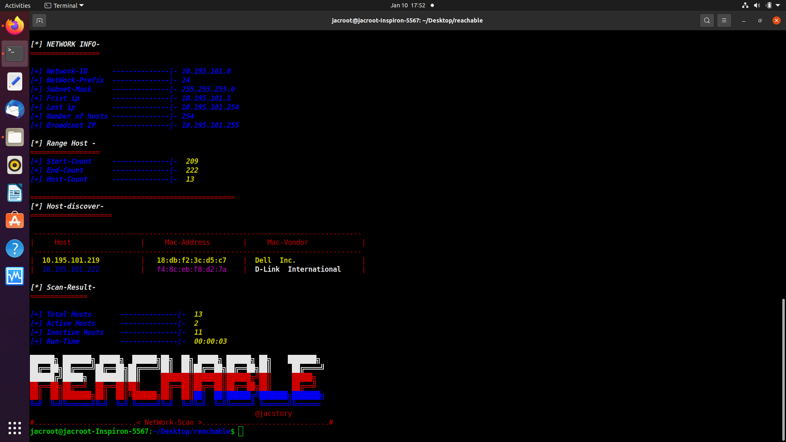

# reachable:-
*****************************
### reachable network scan
* writen by pyhton3 ,help  to discover the hosts devices on the Network ,
 have two ways to get the host on network Ping scan and arp scan,
,by start reachable will regex you host info and your network subnet.
### ping Scan -
-------------------------------------
 - Ping scan by sending Internet Control Message Protocol (ICMP) echo request packets to the target host and waiting for an ICMP echo reply. 
 -  User, can ping all network subnet ,or rangs of ips ,or one host.
 -  reachable tool , will get the mac-addess info , and mac-vendor as well.
*  downbelow the part of response about generate the host ip for all subnet mask ,then send echo ping request ,one by one ,then wating for response ,and use regex to mach the mac-address and print the mac-address and mac-vendor 

 ```python 
 for Host in Network .hosts():
           Host = str(Host)
           DisCover = Popen(["ping", "-w1",Host], stdout=PIPE)
           output   = DisCover.communicate()[0]
           respons  = DisCover.returncode                       
           if respons == 0:
               Hcount  +=1	
               if Host == host_ip:
                   print(Y+I+D+"[+] HOST OnLine     --------------| ",host_ip)
               else:
                   print(B+I+D+"[+] HOST OnLine     --------------| ",Host)      
               if self.args.output :
                   printF = str("[+] HOST OnLine     --------------|  " + Host).strip()
                   with  open (self.args.output,"a") as out_put :
                         out_put.write(printF+"\n")
                   pid = Popen(["arp", "-a", Host], stdout=PIPE)
                   arp_host = pid.communicate()[0]                          
                   Mac_arp = str(arp_host)
                   Macaddr = re.compile(r'(?:[0-9a-fA-F]:?){12}')
                   Mac = str(re.findall(Macaddr ,Mac_arp)).replace("['",'').replace("']","")
                   if "no match found" in Mac_arp and str(ipaddress.ip_address(Host)) ==  str(ipaddress.ip_address(host_ip)) :
                          print(Y+D+I+"[*] Mac-Address     ..............|-",Mac_Interface)
                          if self.args.output :
                                 printF = str("[*] Mac-Address     ..............|- "+Mac_Interface).strip()
                                 with open (self.args.output,'a') as out_put :
                                      out_put.write(str(printF+"\n"))
                          interfaceMac = Mac_Interface[0:8].replace(":","").upper() 
 ```
   

 -----------------------------------------------------------------

 ## arp Scan - 
 -----------------------------------------
 ### Address Resolution Protocol (ARP)
 *  for arp scan i use python socket module to generate raw socket.
 *  send arp request  and receiving  arp replay raw working in network layer2.
 #### raw socket 
 ##### Another very useful socket type is SocketType.Raw, which is used by applications that need to build custom protocol headers encapsulated in the given transport protocol header, which in our case can either be an IPv4 arp protoco,raw socket is created by creating a Socket object and specifying either IPv4 or IPv6, SocketType.Raw, and the Protocol Type .
* [python socket tutorial](https://realpython.com/python-sockets/)
* [arp protocol](https://en.wikipedia.org/wiki/Address_Resolution_Protocol#References)
* [more info](https://www.winsocketdotnetworkprogramming.com/clientserversocketnetworkcommunication8n.html)
* downbelow the part of the code working in raw socket , send the raw  data to the Network broadcast after pack the   data to raw bytes ,and received arp replay , then unpack raw data
 ,then slice ip header data  ,then print the info
```python for Host in Network .hosts():
                        Host = str(Host)
                        rawSocket = socket.socket(socket.PF_PACKET, socket.SOCK_RAW,socket.htons(0x0806))                     
                        rawSocket.settimeout(.20)
                        rawSocket.bind((self.args.Interface,0x0806))
                        source_ip  = bytes(host_ip.encode('utf-8'))
                        dest_ip    = bytes(Host.encode('utf-8'))
                        if dest_ip == source_ip :
                            Hcount  +=1	    
                            print(Y+D+I+"[+] HOST OnLine     --------------|  " + Host)
                            print("[*] Mac-Address     ..............|- " + Mac_Interface)
                            print("[+] Mac-Vendor      --------------|  " + vendor+'\n')
                            if self.args.output :
                                printF += str("[+] HOST OnLine     --------------|  " + Host).strip()+'\n'
                                printF += str("[*] Mac-Address     ..............|- " + Mac_Interface).strip()+'\n'
                                printF += str("[+] Mac-Vendor      --------------|  " + vendor).strip()+'\n'
                                printF +='\n'
                            interfaceMac = Mac_Interface[0:8].replace(":","").upper()
                        else:      
                            source_mac = binascii.unhexlify(Mac_Interface.replace(":",''))
                            dest_mac   = b"\xff\xff\xff\xff\xff\xff"
                            protocol   = 0x0806
                            eth_hdr    = struct.pack("!6s6sH",dest_mac,source_mac,protocol)
                            htype      = 1
                            ptype      = 0x0800
                            hlen       = 6
                            plen       = 4 
                            operations = 1
                            src_ip  = socket.inet_aton(str(source_ip).replace("'","").replace('b',""))
                            des_ip  = socket.inet_aton(str(dest_ip).replace("'","").replace('b',""))
                            arp_hdr = struct.pack("!HHBBH6s4s6s4s",htype,ptype,hlen,plen,operations,source_mac,src_ip,dest_mac,des_ip)
                            Packet         = eth_hdr + arp_hdr
                            try:
                                send_packet    = rawSocket.send(Packet) 
                                recv_replay    = rawSocket.recv(1020)
                                rawSocket.close() 

```
  
-----------------------------------------------------------------
## how to use 
-----------------------------------------------

1.  https://github.com/jac11/reachable.git
2.  cd reachable
3.  chmod +x rachable.py
4.  show help massagess ./reachable -h 
-----------------------------------------------
 ### * Example ping scan :-
-------------------------------------------

#### * To Scan all Subnet Use -N <network/prefix>
```
   ./reachable.py -N 10.195.100.200/25
````
#### * To Scan range of ips Use -N network/prefix -S Start  -E end
```
   ./reachable.py -N 10.195.100.200/24 -S 240 -E 254 
 ```
#### * To Scan one Host  Use  -H  host ip
```
    ./reachable.py -H 10.195.100.200/25
```    
* or
```
    ./reachable.py -H 10.196.100.3
````
#### * To Save the output into file Use -O file name
```
     ./reachable.py -N 10.195.100.200/24 -S 240 -E 254 -O report.txt
 ```    
--------------------------------------------------------
 ### * Example arp scan-:-
------------------------------------------------
#### * To Scan all Subnet Use -N network/prefix -I  Interface
```
     sudo ./reachable.py -N 10.195.100.200/25 -I eth0 
```
 #### * To Scan range of ips Use -N <network/prefix> -S Start  -E end
 ```
     sudo ./reachable.py -N 10.195.100.200/24  -I eth0 -S 240 -E 254 
```
#### * To Scan one Host  Use  -H  host ip
```
     sudo ./reachable.py -H 10.195.100.200/25 -I eth0
 ```    
 * or
 ```
     sudo ./reachable.py -H 10.196.100.3 -I wlan0
```
#### * To Save the output into file Use -O file name
```
  sudo ./reachable.py -N 10.195.100.200/24  -I eth0 -S 240 -E 254 -O report.txt
```
###  Noted:-
--------------------------------------
###  For arp Scan Use root Login or  sudo privileges 
###  to use -I or --Interface  use ifconfig to make sure that any of the interface are available
-----------------------------------------
## connect :
- administartor@jacstory.toch
-  thank you 
 
